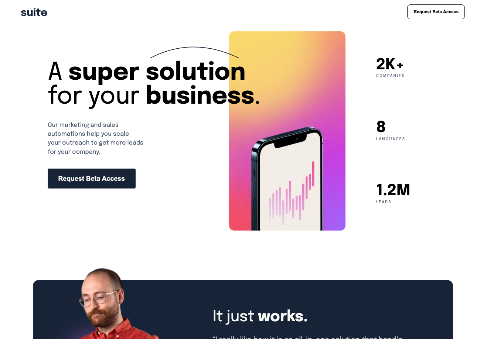

# Frontend Mentor - Suite landing page solution

This is a solution to the [Suite landing page challenge on Frontend Mentor](https://www.frontendmentor.io/challenges/suite-landing-page-tj_eaU-Ra). Frontend Mentor challenges help you improve your coding skills by building realistic projects.

## Overview

### The challenge

Users should be able to:

- View the optimal layout depending on their device's screen size
- See hover states for interactive elements

### Screenshot

### Links

- Solution URL: [Add solution URL here](https://your-solution-url.com)
- Live Site URL: [Add live site URL here](https://your-live-site-url.com)

## My process

### Built with

- Semantic HTML5 markup
- CSS custom properties
- Flexbox
- CSS Grid
- Mobile-first workflow
- Sass

### What I learned

I really learned my grid on this one. Encourage you to take the NetNinja class on CSS Grid.

### Useful resources

- NetNinja CSS Videos - https://www.youtube.com/watch?v=x7tLPhnA06w&list=PL4cUxeGkcC9itC4TxYMzFCfveyutyPOCY 

## Author

- Frontend Mentor - @maxKaiser

